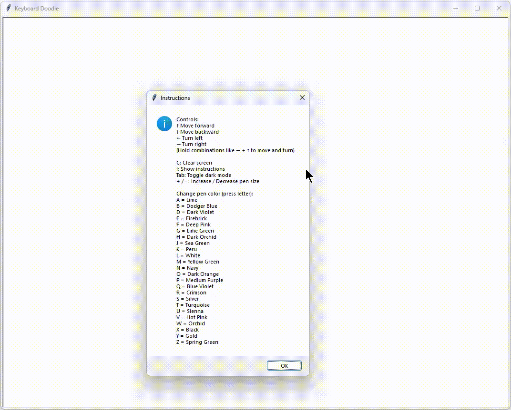
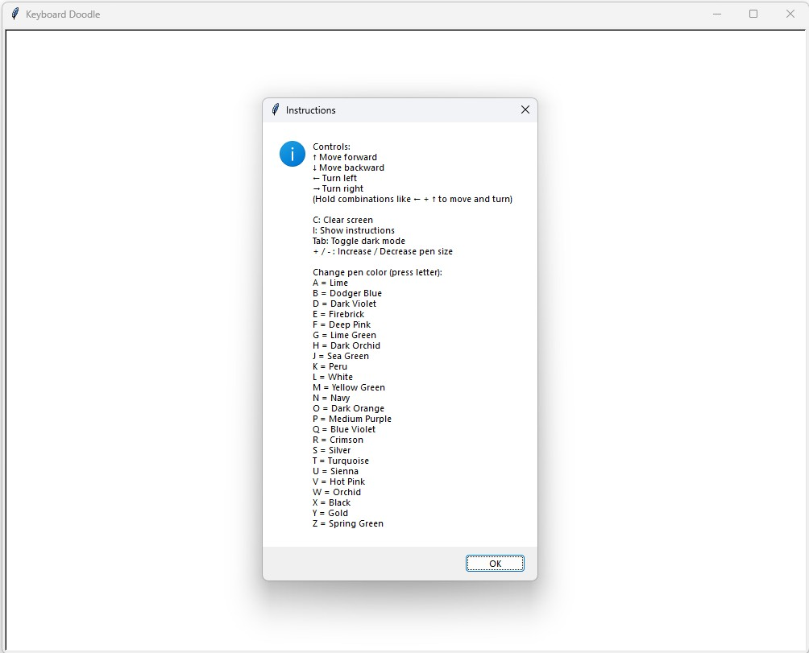
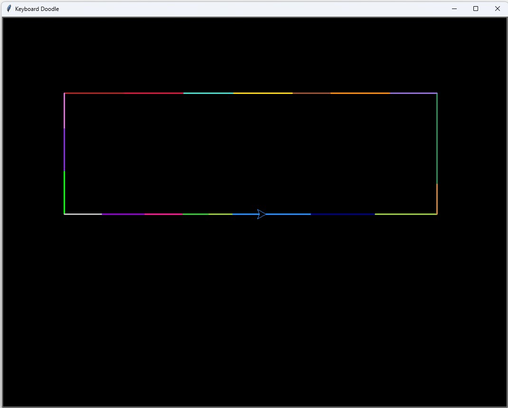

# keyboard-doodle
A Python turtle-based drawing program inspired by Etch A Sketch. Control the turtle with arrow keys and change the pen color using letter keys. Includes light/dark mode and on-screen help.





## Description
* Use the arrow keys ↑ ↓ ← → to move the turtle and draw
* Press letter keys to switch between unique, vibrant pen colors
* Toggle between light and dark backgrounds using the `Tab` key
* Open a help/instructions window by pressing the `i` key
* Press the `c` to clear the screen


## Controls

| Key             | Action                                      |
|-----------------|-----------------------------------------------|
| ↑ ↓ ← →         | Move turtle up, down, left, right            |
| `Tab`           | Toggle light/dark mode                       |
| `c`             | Clear the screen                             |
| `i`             | Show instruction menu                     |
| `+` or `-`      | Increase or decrease pen size                            |




## Colors
> <small>**Note**: Emoji previews approximate the color and may vary by device.</small>

| Key | Color Name       | Preview |
|-----|------------------|---------|
| a   | lime             | 🟢      |
| b   | dodger blue      | 🔵      |
| d   | dark violet      | 🟣      |
| e   | firebrick        | 🔴      |
| f   | deep pink        | 🌸      |
| g   | lime green       | 🟢      |
| h   | dark orchid      | 🟣      |
| j   | sea green        | 🟢      |
| k   | peru             | 🟤      |
| l   | white            | ⚪      |
| m   | yellow green     | 🟢      |
| n   | navy             | 🔵      |
| o   | dark orange      | 🟠      |
| p   | medium purple    | 🟣      |
| q   | blue violet      | 🔵      |
| r   | crimson          | 🔴      |
| s   | silver           | ⚪      |
| t   | turquoise        | 🟦      |
| u   | sienna           | 🟤      |
| v   | hot pink         | 🌸      |
| w   | orchid           | 🟣      |
| x   | black            | ⚫      |
| y   | gold             | 🟡      |
| z   | spring green     | 🟢      |

## Requirements

- Python 3.x
- Uses built-in `turtle` module

## Run the Program

```bash
git clone https://github.com/emh68/keyboard-doodle.git
cd keyboard-doodle
python main.py # may need to use python3 main.py instead
```
